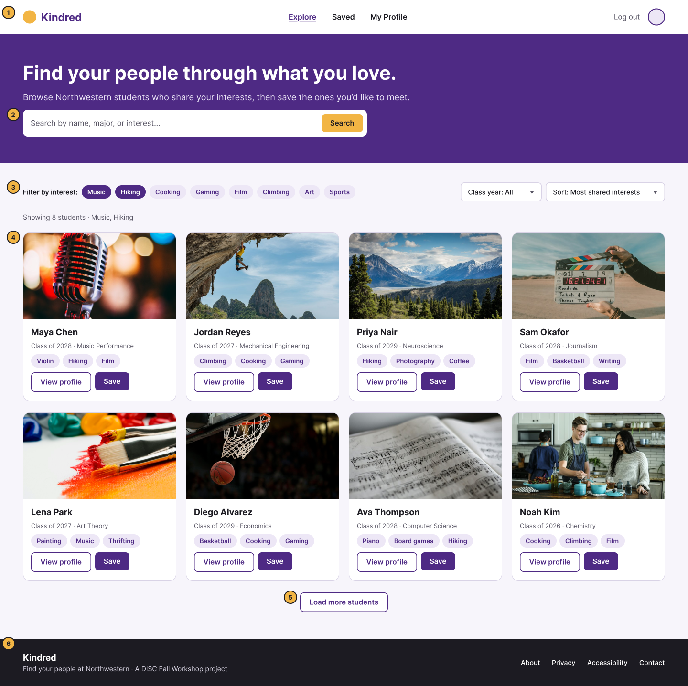
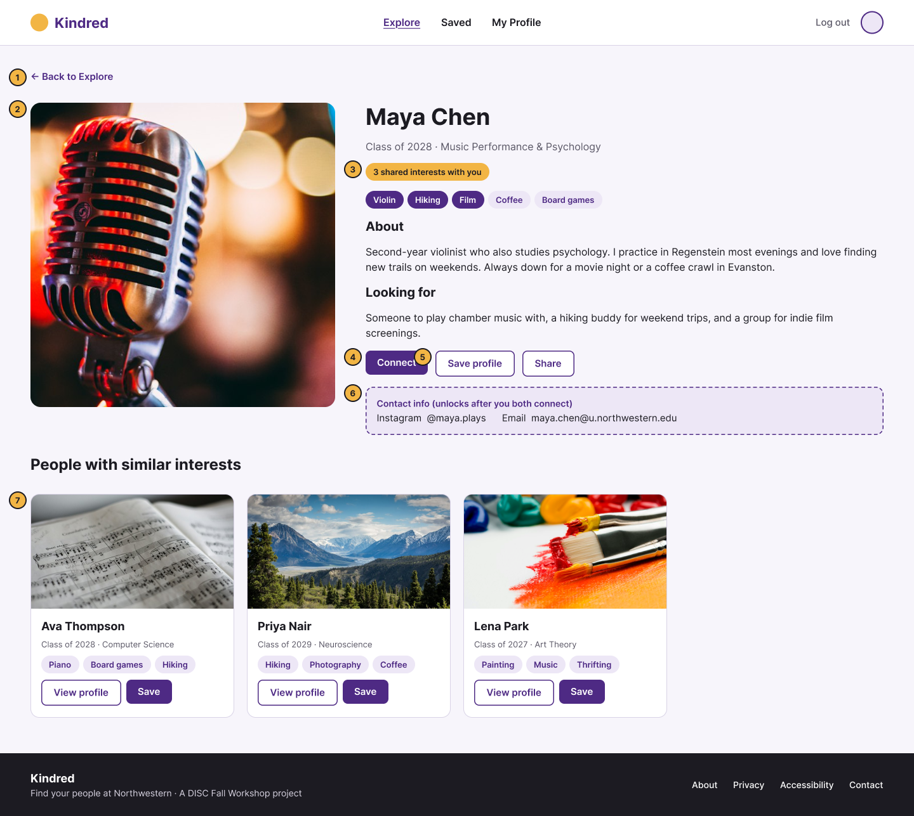
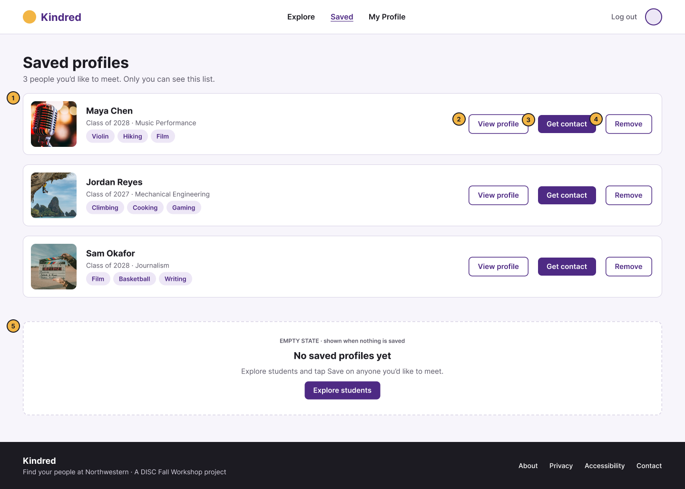
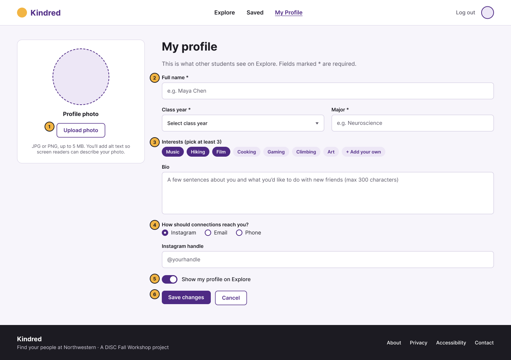
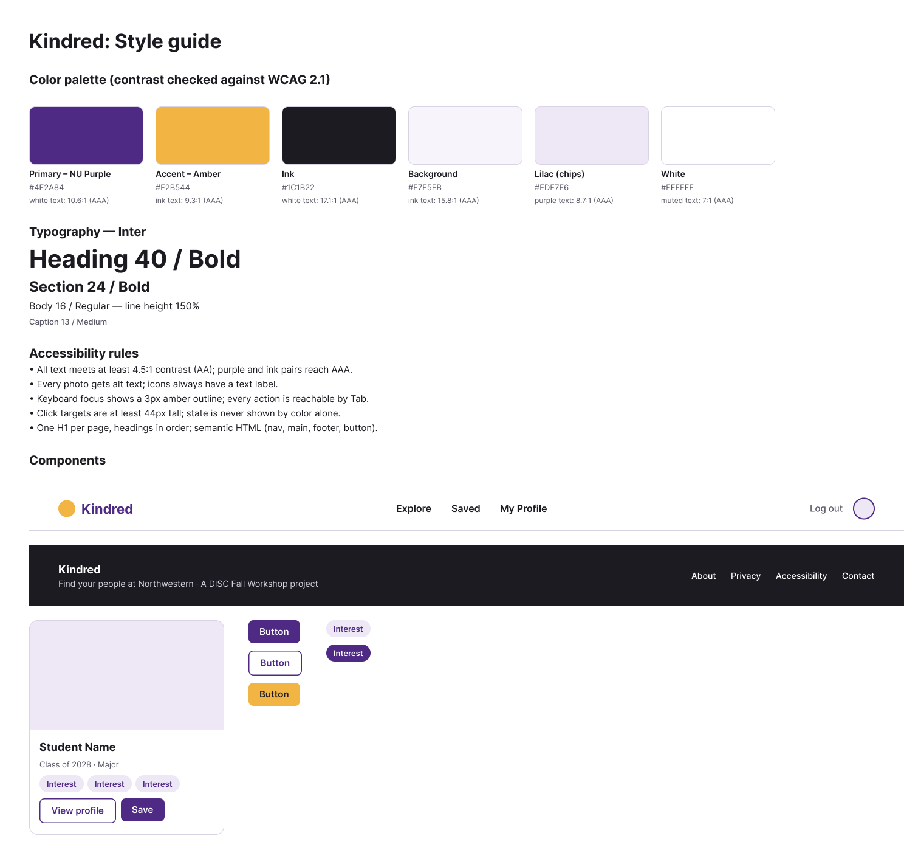

# Assignment 1: Figma wireframe

**Figma file:** https://www.figma.com/design/jOhtawb9NAsttiuuXhBHab/

## Concept
Kindred: browse Northwestern students by shared interests (music, hiking, film, and more),
save the ones you'd like to meet, and connect to unlock their contact info.

## Pages
1. **Explore (Home)**: search, interest filters, and a grid of profile cards
2. **Profile Detail**: full profile, shared-interest badge, Connect / Save
3. **Saved Profiles**: list of saved students, plus an empty state
4. **My Profile (Edit)**: form for photo, interests, bio, contact method

## Screens
Snapshot exported from Figma (the Figma file above is always the latest version).

| Explore | Profile Detail |
|---|---|
|  |  |
| **Saved** | **My Profile** |
|  |  |

## Requirements checklist
- [x] At least 3 pages (4)
- [x] Navbar and footer on every page (components)
- [x] A page showing many profiles (Explore grid)
- [x] Notes on buttons and interactions (numbered annotations)
- [x] At least 4 accessible colors (6, contrast checked to WCAG AA)
- [x] At least 2 images (8)
- [x] At least 3 components (Navbar, Footer, Profile Card, Buttons, Chips)
